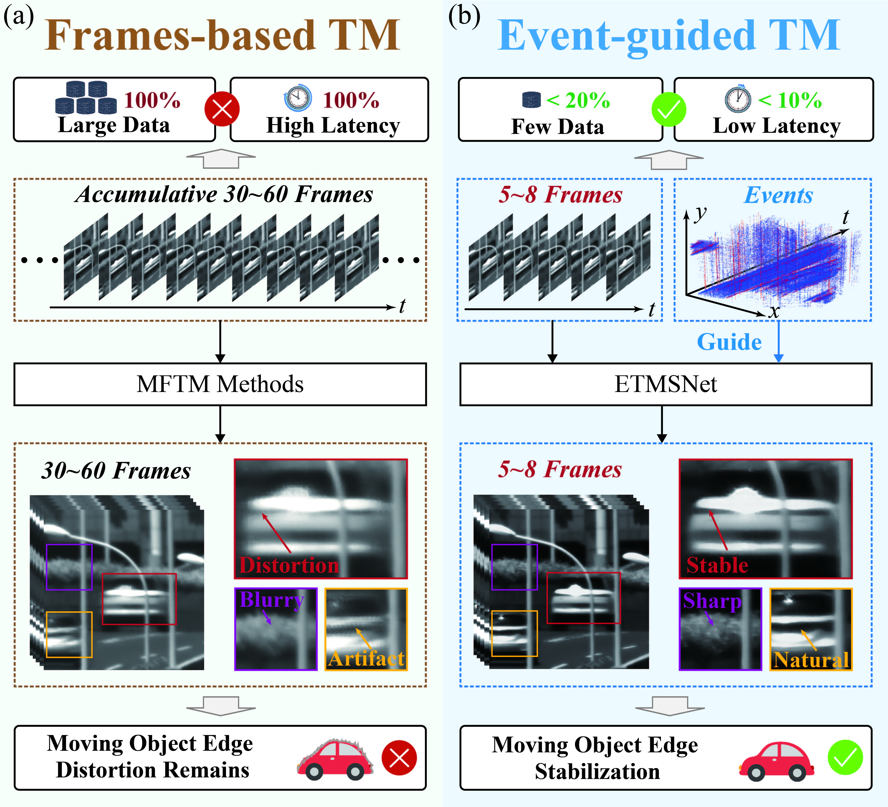

# [CVPR 2026] High-Quality and Efficient Turbulence Mitigation with Events
## 📰 News
2026.02.23: Our paper is accepted by CVPR 2026! 

2026.03.25: Our paper is now available online. [arXiv](https://arxiv.org/abs/2603.20708)

2026.03.27: We have released our CTTH and LATH datasets!

The full code will be released soon.

---

## 📌 Overview

<p align="center">
  
</p>

<p align="center">
  <em>Workflow comparison between our EHETM and multiframe TM methods.</em>
</p>

<p align="center">
  
</p>

<p align="center">
  <em>Overall Architecture of the EHETM.</em>
</p>

---

## 📦 Dataset

We present **CTTH and LATH**, **two event–frame paired datasets** for turbulence imaging research, covering both **thermal** and **atmospheric** cases. We offer **Baidu Cloud Drive** ([Download Link](https://pan.baidu.com/s/1XsDaJTYYfcgNENzEL0_wqw?pwd=qaz3), code: qaz3). Dataset structure is organized as:

```
Dataset/
├── CTTH/
│   ├── Dynamic_Object/
│   │   ├── Train/
│   │   │   ├── seq_000/
│   │   │   │   ├── GT/
│   │   │   │   │   ├── frames/
│   │   │   │   │   ├── events/
│   │   │   │   │   ├── frame_timestamp.txt
│   │   │   │   │   └── event_timestamp.txt
│   │   │   │   ├── Turb/
│   │   │   │   │   ├── frames/
│   │   │   │   │   ├── events/
│   │   │   │   │   ├── frame_timestamp.txt
│   │   │   │   │   └── event_timestamp.txt
│   │   │   │   └── Flow/
│   │   │   └── ...
│   │   └── Test/
│   │       ├── seq_000/
│   │       └── ...
│   │
│   ├── Static/
│   │   ├── Train/
│   │   │   ├── seq_000/
│   │   │   │   ├── turb/
│   │   │   │   ├── event/
│   │   │   │   ├── frame_timestamp.txt
│   │   │   │   ├── event_timestamp.txt
│   │   │   │   └── gt.jpg
│   │   │   └── ...
│   │   └── Test/
│   │       ├── seq_000/
│   │       └── ...
│
├── LATH/
│   ├── seq_000/
│   │   ├── turb/
│   │   ├── events/
│   │   ├── frame_timestamp.txt
│   │   └── event_timestamp.txt
│   └── ...
```

Each sequence in the dataset contains synchronized frame images, event data, and corresponding timestamps, including `frames/`, `events/`, `frame_timestamp.txt`, and `event_timestamp.txt`. 

- **frames/**: intensity images captured at a fixed frame rate (25hz)  
- **events/**: event time-slice recorded by the event camera (positive = 200, negative = 100, background = 0)
- **frame_timestamp.txt**: timestamps for each frame  
- **event_timestamp.txt**: timestamps for event data  
- **Flow/** (if available): ground-truth optical flow (dynamic-object scenes only)

The event data is captured using the ALPIX-Pizol camera, which outputs events in a time-sliced format rather than fully asynchronous streams. Specifically, events are grouped into temporal slices, where all events within each slice share a single timestamp, representing accumulated events over a short time window (1ms). This representation should be taken into account when processing events (e.g., voxelization or temporal alignment). To facilitate usage, we provide scripts to convert the time-sliced events into voxels and polarity alternation statistics (see [tools/event_processing.py](tools/event_processing.py)). More details about the sensor can be found on the Alpsentek official website: https://www.alpsentek.com/.

### 🔥 CTTH: Close-range Thermal Turbulence Hybrid Dataset

<table align="center">
  <tr>
    <th>GT</th>
    <th>Turbulent Video</th>
    <th>Events</th>
    <th>GT</th>
    <th>Turbulent Video</th>
    <th>Events</th>
  </tr>
  <tr>
    <td></td>
    <td></td>
    <td></td>
    <td></td>
    <td></td>
    <td></td>
  </tr>
  <tr>
    <td></td>
    <td></td>
    <td></td>
    <td></td>
    <td></td>
    <td></td>
  </tr>
</table>

<p align="center">
  <em>Each group shows ground truth, turbulent observation, and corresponding events.</em>
</p>

The CTTH dataset is designed to capture:

- 🚗 Dynamic object
- 🏙️ Static background structures
- 🎯 Corresponding ground-truth references

This enables rigorous evaluation of turbulence mitigation under **real static and dynamic-object scenes**.

---

### 🌫️ LATH: Long-range Atmospheric Turbulence Hybrid Dataset

<table align="center">
  <!-- 列标题 -->
  <tr>
    <th>Turbulent Video</th>
    <th>Events</th>
    <th>Turbulent Video</th>
    <th>Events</th>
  </tr>

  <!-- 第一行内容 -->
  <tr>
    <td></td>
    <td></td>
    <td></td>
    <td></td>
  </tr>

  <!-- 第一行的分组说明 -->
  <tr>
    <td colspan="2" align="center"><em>3.5Km, Building</em></td>
    <td colspan="2" align="center"><em>5Km, Signs and Moving Cars</em></td>
  </tr>

  <!-- 第二行内容 -->
  <tr>
    <td></td>
    <td></td>
    <td></td>
    <td></td>
  </tr>

  <!-- 第二行的分组说明 -->
  <tr>
    <td colspan="2" align="center"><em>6.5Km, Heavy Traffic</em></td>
    <td colspan="2" align="center"><em>8Km, Bridge</em></td>
  </tr>
</table>

<p align="center">
  <em>Examples of atmospheric turbulence under different shooting distances.</em>
</p>

The LATH dataset captures turbulence effects across **various imaging distances and scenes**, including:

- 🌉 Long-range imaging
- 🏞️ Diverse environmental structures

This provides a valuable benchmark for evaluating **generalization under real-world atmospheric turbulence**.

---

The datasets are designed to support:
- **Turbulence mitigation**
- **Event-based video/image restoration**
---

## 📚 Citation

If you find this work helpful in your research, welcome to cite our paper and give a ⭐.

```bibtex
@article{zhang2026high,
  title={High-Quality and Efficient Turbulence Mitigation with Events},
  author={Zhang, Xiaoran and Ding, Jian and Duan, Yuxing and Liu, Haoyue and Chen, Gang and Chang, Yi and Yan, Luxin},
  journal={arXiv preprint arXiv:2603.20708},
  year={2026}
}
